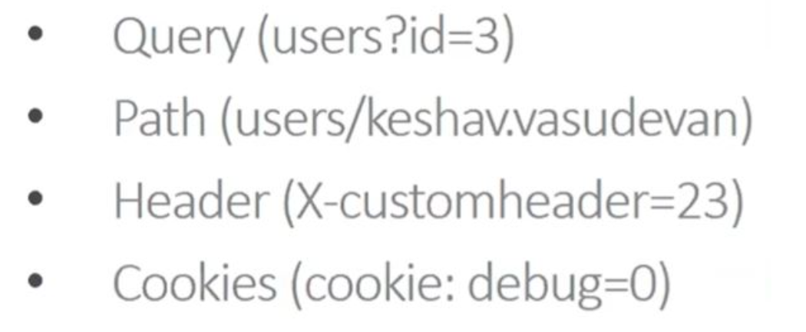
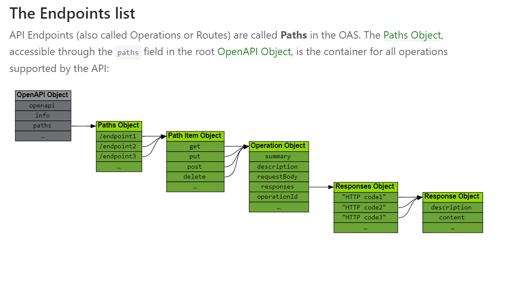

# OpenAPI Specification

## Advantage using OpenAPI

- Understand by machines and humans.
- one can generate both server and client code in any programming language.
- use mock servers to provide example responses which enable both consumers and producers to start development at a same time.
- can perform the validation in both direction

## Open API Structure

[OpenAPI Map](https://openapi-map.apihandyman.io/)

1. **openapi** `string` `required` - The openapi field SHOULD be used by tooling specifications and clients to interpret the OpenAPI document. This is not related to the API info.version string.

   ```JSON
   {
     "openapi": "3.0.0",
   }
   ```

   ```JSON
   {
     "swagger": "2.0",
   }
   ```

2. **info** (6) `required` - Provides metadata about the API. The metadata MAY be used by tooling as required.

   - title `required`
   - description
   - termsOfService
   - contact
     - name
     - url
     - email
   - license
     - name `required`
     - url
   - version `required`

   ```JSON
   {
     "title": "Sample Pet Store App",
     "description": "This is a sample server for a pet store.",
     "termsOfService": "http://example.com/terms/",
     "contact": {
       "name": "API Support",
       "url": "http://www.example.com/support",
       "email": "support@example.com"
     },
     "license": {
       "name": "Apache 2.0",
       "url": "https://www.apache.org/licenses/LICENSE-2.0.html"
     },
     "version": "1.0.1"
   }
   ```

3. **servers** (3) - If the servers property is not provided, or is an empty array, the default value would be a Server Object with a url value of /.

   - url `required`
   - description
   - variables

     - enum
     - default `required`
     - description

     A single server would be described as:

     ```JSON
     {
       "url": "https://development.gigantic-server.com/v1",
       "description": "Development server"
     }
     ```

     multiple servers can be described

     ```JSON
           {
             "servers": [
               {
                 "url": "https://development.gigantic-server.com/v1",
                 "description": "Development server"
               },
               {
                 "url": "https://staging.gigantic-server.com/v1",
                 "description": "Staging server"
               },
               {
                 "url": "https://api.gigantic-server.com/v1",
                 "description": "Production server"
               }
             ]
           }
     ```

     variables can be used for a server configuration

     ```JSON
           {
             "servers": [
               {
                 "url": "https://{username}.gigantic-server.com:{port}/{basePath}",
                 "description": "The production API server",
                 "variables": {
                   "username": {
                     "default": "demo",
                     "description": "this value is assigned by the service provider, in this example `gigantic-server.com`"
                   },
                   "port": {
                     "enum": [
                       "8443",
                       "443"
                     ],
                     "default": "8443"
                   },
                   "basePath": {
                     "default": "v2"
                   }
                 }
               }
             ]
           }
     ```

4. **paths** `reqired` - The available paths and operations for the API.

   - Path Item (13) - A relative path to an individual endpoint. The field name MUST begin with a forward slash (/)

     - $ref
     - summary
     - description
     - get `Operation Object`
     - put `Operation Object`
     - post `Operation Object`
     - delete `Operation Object`
     - options `Operation Object`
     - head `Operation Object`
     - patch `Operation Object`
     - trace `Operation Object`
     - servers
     - parameters (4) (There are four possible parameter locations specified by the `in` field:)

       - path
       - query
       - header
       - cookie

       

5. **components** (9) - An element to hold various schemas for the specification.

   - schemas
     - Type
     - Format
   - responses  
     _The Responses Object MUST contain at least one response code, and it SHOULD be the response for a successful operation call._

     - description `required`
     - headers

     - content
     - links

     ```JSON
     {
       "200": {
         "description": "a pet to be returned",
         "content": {
           "application/json": {
             "schema": {
               "$ref": "#/components/schemas/Pet"
             }
           }
         }
       }
      }
     ```

   - parameters
   - examples
   - requestBodies
     - description
     - content
     - required
   - headers
   - [securitySchemes](securitySchemes.md)
   - links
     - operationRef
     - operationId
     - parameters
     - requestBody
     - description
     - server
   - callbacks

6. **security** - A declaration of which security mechanisms can be used across the API.
   - {name} - Each name MUST correspond to a security scheme which is declared in the Security Schemes under the Components Object.
7. **tags** - A list of tags used by the specification with additional metadata.

   - name
   - description
   - externalDocs - Additional external documentation.
     - description
     - url

   ```JSON


           {    "tags":
                 [
                             {"name": "pet",
                              "description": "Everything about your Pets",
                              "externalDocs": {
                                               "description": "Find out more",
                                               "url": "http://swagger.io"}
                             },
                             {"name": "store",
                              "description": "Access to Petstore orders"
                              },
                             {"name": "user",
                              "description": "Operations about user",
                               "externalDocs": {
                                             "description": "Find out more about our store"
                                             "url": "http://swagger.io"}
                           }
                 ]
            }
   ```

# Difference between 2.0 and 3.0


# Object Flows


