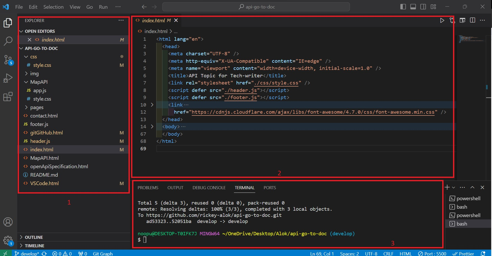

# VS Code - Cheat sheet

VS code, also known as Visual Studio Code, is a lightweight and powerful open-source code editor by Microsoft. It is prevalent amongst the developer community to build and debug applications.

It supports almost all sorts of programming languages for building applications, which makes it a super-friendly Integrated Development Environment (IDE) for developers. Yet, many extensions are available for writers that help in formatting content or auto syntax correction, which elevates writers productivity.

VS code also integrates well with the Git and GitHub which makes collaboration easier and faster.

